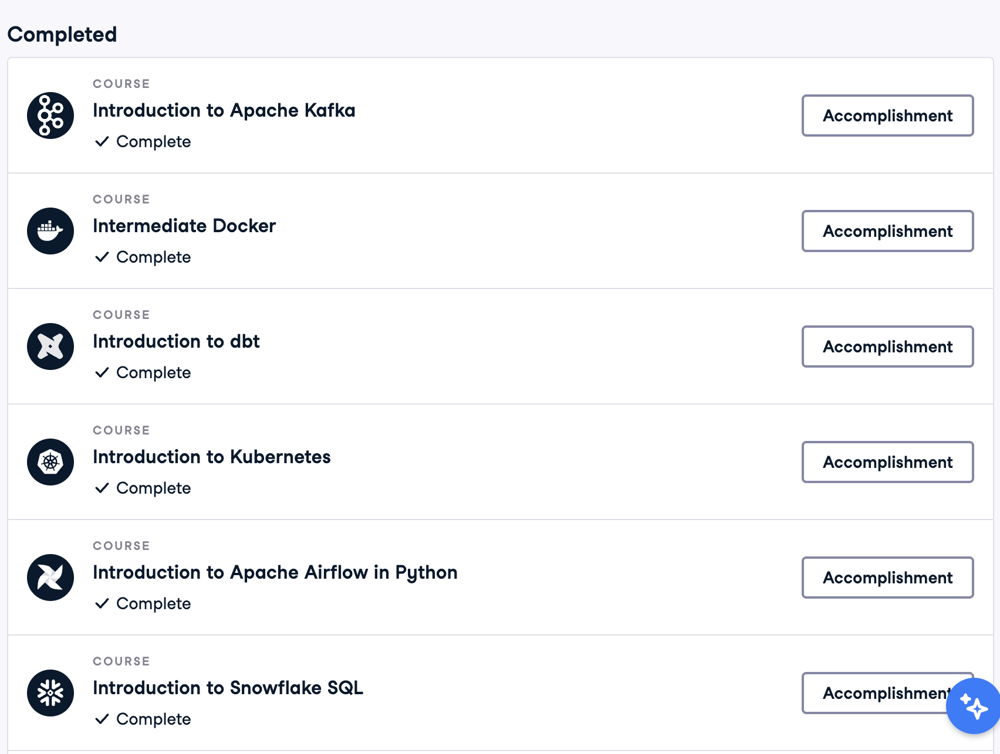

# Data Engineering Course Notes - DE Zoomcamp

## Overview

This repository contains homework assignments and personal notes from the Data Engineering Zoomcamp. It includes assignments and notes on data processing, stream processing, data warehousing, and data ingestion.

## ⚒️ Course Homework

[Data Engineering Zoomcamp](https://github.com/DataTalksClub/data-engineering-zoomcamp) is a course offered by DataTalks.Club. The course primarily uses NYC Taxi datasets to build an end-to-end pipeline—from data ingestion to visualization.

This repository contains the homework assignments completed as part of the Data Engineering Zoomcamp:

- **Data Warehousing**: [Google Cloud Platform - BigQuery](/bigquery/)
- **Data Ingestion**: [DLT](/dlt)
- **Data Processing**: [Apache Spark](/pyspark)
- **Stream Processing**: Kafka, [pyflink](/pyflink)

## 📚 Course Notes

Throughout the course, I have written several articles and maintained detailed notes on various data engineering components and best practices.

- **Infrastructure as Code**: [Terraform](/terraform)
- **Containerization**: [Docker](/docker), [Kubernetes](/k8s)
- **Data Modeling & Transformation**: [dbt](/dbt)

## 🌱 Learning Beyond the Course

I believe that continuous learning is essential in the tech industry. In addition to this course, I follow several other resources to broaden my understanding of data engineering:

1. **[IBM Technology YouTube Channel](https://www.youtube.com/@IBMTechnology)**  
   10-minute videos provide high-level explanations that help prepare for deeper dives into technical topics. For example, while learning Docker, I watched these videos:
   - [Virtualization Explained](https://www.youtube.com/watch?v=FZR0rG3HKIk)
   - [Containers vs VMs: What's the Difference?](https://www.youtube.com/watch?v=cjXI-yxqGTI)
   - [Containerization Explained](https://www.youtube.com/watch?v=0qotVMX-J5s)
   - [Virtual Machine (VM) vs Docker](https://www.youtube.com/watch?v=a1M_thDTqmU)

2. **Official Documentation and Resources**  
   High-quality documentation and courses provided by relevant platforms. For example:
   - **dbt Cloud**: Explore [dbt Quickstarts](https://docs.getdbt.com/docs/get-started-dbt) and gain hands-on experience with [dbt Fundamentals](https://learn.getdbt.com/courses/dbt-fundamentals).
   - **Apache Spark**: Although Apache Spark does not have a dedicated official learning tool, Confluent (founded by the original creators of Apache Kafka) offers an excellent introductory course: [Kafka 101](https://developer.confluent.io/courses/apache-kafka/events/).
   - **Airflow**: For Apache Airflow, check out Astronomer's [Airflow 101](https://academy.astronomer.io/path/airflow-101) course.

3. **DataCamp**  
   I also use DataCamp as a supplementary resource to deepen my understanding of various data engineering components. The following are several courses I've completed:
   

