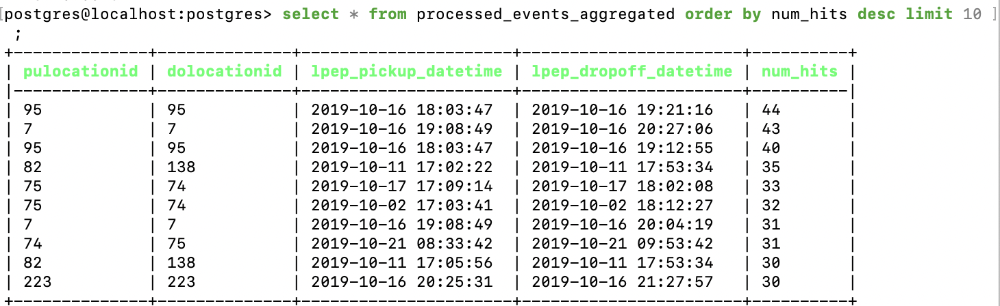

## Q1
Run the command `rpk version`

## Q2
Run the command `rpk topic create green-trips`

## Q3-Q4

Solutions can be found in the [producer.py](https://github.com/fengyu20/data-engineering-zoomcamp-2025/tree/main/pyflink/src/producer.py)


## Q5

Solution can be found in the [session_job.py](https://github.com/fengyu20/data-engineering-zoomcamp-2025/tree/main/pyflink/src/session_job.py)

Steps:
1. Run `docker-compose up` to start all containers.
2. Connect to PostgreSQL using:
   ```bash
   pgcli -h localhost -p 5432 -u postgres -d postgres
   ```
   Then, create the table using:
   ```sql
   CREATE TABLE processed_events_aggregated (
       PULocationID INT,
       DOLocationID INT,
       lpep_pickup_datetime TIMESTAMP(3),
       lpep_dropoff_datetime TIMESTAMP(3),
       num_hits BIGINT,
       PRIMARY KEY (PULocationID, DOLocationID, lpep_pickup_datetime, lpep_dropoff_datetime)
   );
   ```
3. Enter the jobmanager container:
   ```bash
   docker compose exec jobmanager bash
   ```
   Then run the Python files in the following order:
   - `python /opt/src/producer.py`
   - `python /opt/src/session_job.py`
4. Run the SQL command in the POstgreSQL database:
    ```sql
    select 
        *
    from   
        processed_events_aggregated 
    order by 
        num_hits desc 
    limit 10;
    ```
    - 
5. Verify the Source data:
    - Create the source data table;
    ```sql
    CREATE TABLE green_tripdata (
        VendorID              INTEGER,
        lpep_pickup_datetime  TIMESTAMP,
        lpep_dropoff_datetime TIMESTAMP,
        store_and_fwd_flag    VARCHAR(1),
        RatecodeID            INTEGER,
        PULocationID          INTEGER,
        DOLocationID          INTEGER,
        passenger_count       INTEGER,
        trip_distance         NUMERIC,
        fare_amount           NUMERIC,
        extra                 NUMERIC,
        mta_tax               NUMERIC,
        tip_amount            NUMERIC,
        tolls_amount          NUMERIC,
        ehail_fee             NUMERIC, 
        improvement_surcharge NUMERIC,
        total_amount          NUMERIC,
        payment_type          INTEGER,
        trip_type             INTEGER,
        congestion_surcharge  NUMERIC
        );
    ```
    - Import the CSV
    ```sql
    \copy green_tripdata FROM 'green_tripdata_2019-10.csv' WITH (FORMAT csv, HEADER true);
    ```
    - Run the SQL Command to see if there are trips have the same pickup and dropoff location.
    ```sql
    SELECT
        PULocationID,
        DOLocationID,
        COUNT(*) AS cnt
    FROM green_tripdata
    WHERE PULocationID = DOLocationID
    GROUP BY PULocationID, DOLocationID
    ORDER BY cnt DESC;
    ```
    - Check the trips between this time slot.
    ```sql
    SELECT
        PULocationID,
        DOLocationID,
        lpep_pickup_datetime,
        lpep_dropoff_datetime
    FROM green_tripdata
    WHERE 
        lpep_pickup_datetime >= '2019-10-16 18:03:47'
        and lpep_dropoff_datetime <= '2019-10-16 19:21:16'
    order by
        lpep_pickup_datetime
    ```